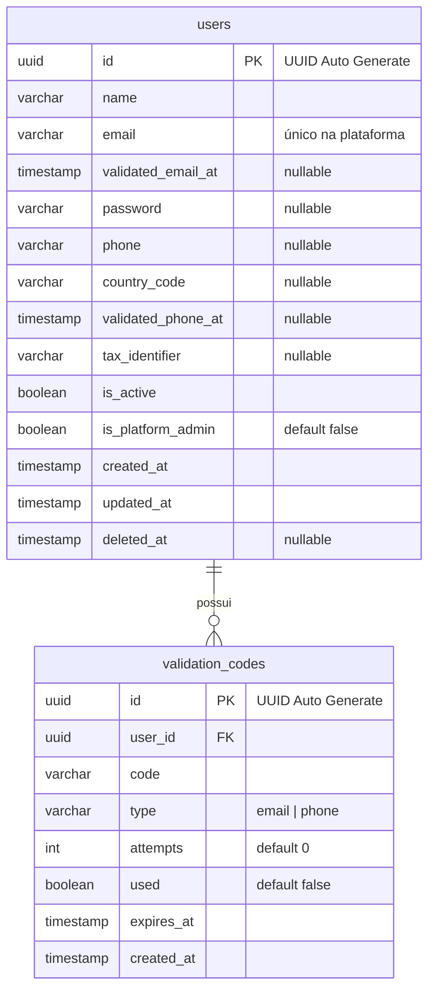

# Entity Relationship Diagram (ERD)

Este documento descreve o modelo de dados **efetivamente implementado** (com migration).

> **Atenção:** Toda migration que criar, alterar ou remover tabelas/colunas/FKs deve
> ser refletida aqui. Este ERD reflete o schema real — não documentar tabelas que
> ainda não têm migration (o modelo planejado de futebol vive na spec, ver seção final).

> **B2C — sem multi-tenant.** As tabelas `tenants` e `user_tenants` foram
> **removidas** (migration `DropTenantTables`). Dados do usuário escopam por
> `user_id`; dados de futebol são globais.

---

# Diagrama (schema atual)



---

# Tabelas

## `users`

Raiz do modelo B2C — cada usuário é um cliente individual. Sem `tenant_id`.

| Coluna               | Tipo           | Obrigatório | Padrão              | Descrição                     |
| -------------------- | -------------- | ----------- | ------------------- | ----------------------------- |
| `id`                 | `uuid`         | ✅          | `gen_random_uuid()` | Identificador único           |
| `name`               | `varchar(255)` | ✅          | —                   | Nome completo                 |
| `email`              | `varchar(255)` | ✅          | —                   | E-mail (único na plataforma)  |
| `validated_email_at` | `timestamp`    | ❌          | `null`              | Timestamp de validação email  |
| `password`           | `varchar(255)` | ❌          | `null`              | Senha (hash bcrypt)           |
| `phone`              | `varchar(20)`  | ❌          | `null`              | Telefone                      |
| `country_code`       | `varchar(8)`   | ❌          | `null`              | DDI do telefone               |
| `validated_phone_at` | `timestamp`    | ❌          | `null`              | Timestamp de validação phone  |
| `tax_identifier`     | `varchar(20)`  | ❌          | `null`              | Identificador fiscal          |
| `is_active`          | `boolean`      | ✅          | `true`              | Se o usuário está ativo       |
| `is_platform_admin`  | `boolean`      | ✅          | `false`             | Admin da plataforma           |
| `created_at`         | `timestamp`    | ✅          | `now()`             | Data de criação               |
| `updated_at`         | `timestamp`    | ✅          | `now()`             | Data de atualização           |
| `deleted_at`         | `timestamp`    | ❌          | `null`              | Data de soft delete           |

### Constraints

| Nome                 | Tipo          | Colunas |
| -------------------- | ------------- | ------- |
| `users_pkey`         | `PRIMARY KEY` | `id`    |
| `users_email_unique` | `UNIQUE`      | `email` |

---

## `validation_codes`

Códigos de validação de email e telefone durante o onboarding.

| Coluna       | Tipo          | Obrigatório | Padrão              | Descrição                          |
| ------------ | ------------- | ----------- | ------------------- | ---------------------------------- |
| `id`         | `uuid`        | ✅          | `gen_random_uuid()` | Identificador único                |
| `user_id`    | `uuid`        | ✅          | —                   | Usuário dono do código             |
| `code`       | `varchar(6)`  | ✅          | —                   | Código de 6 dígitos                |
| `type`       | `varchar(20)` | ✅          | —                   | `email` ou `phone`                 |
| `attempts`   | `int`         | ✅          | `0`                 | Tentativas de validação realizadas |
| `used`       | `boolean`     | ✅          | `false`             | Se o código já foi utilizado       |
| `expires_at` | `timestamp`   | ✅          | —                   | Expiração do código                |
| `created_at` | `timestamp`   | ✅          | `now()`             | Data de criação                    |

### Constraints

| Nome                    | Tipo          | Colunas |
| ----------------------- | ------------- | ------- |
| `validation_codes_pkey` | `PRIMARY KEY` | `id`    |

---

# Modelo Planejado — Football Analytics

As tabelas de domínio de futebol (`competitions`, `teams`, `players`,
`player_teams`, `referees`, `matches`, `event_types`, `match_events`) **ainda não
têm migration**. O modelo alvo está especificado em:

```
specs/football-analytics/01-data-ingestion-acl.md
```

Assim que cada tabela ganhar sua migration, deve ser promovida para este ERD.
Lembrete: as tabelas de futebol são **reference data global (sem `tenant_id`)`**.
